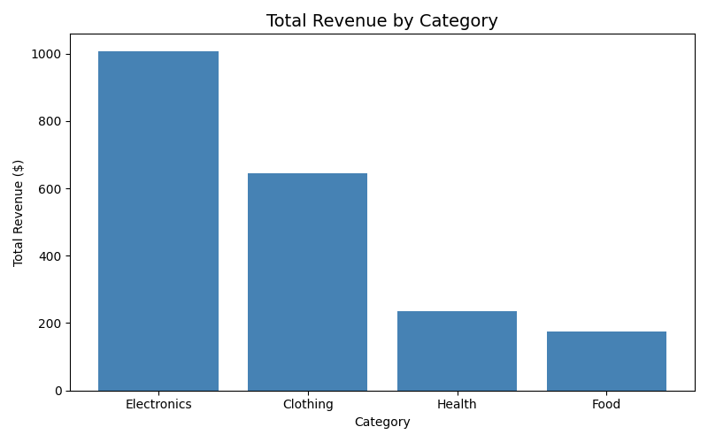
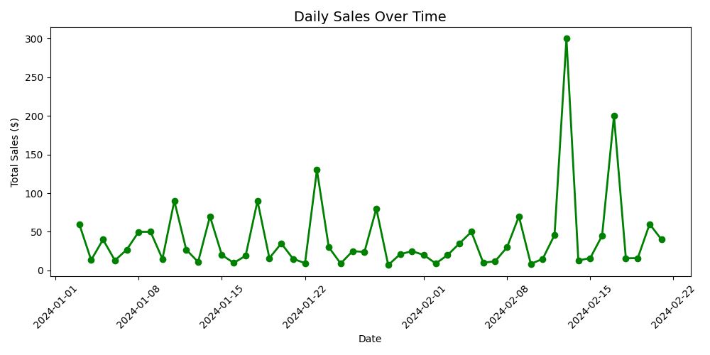
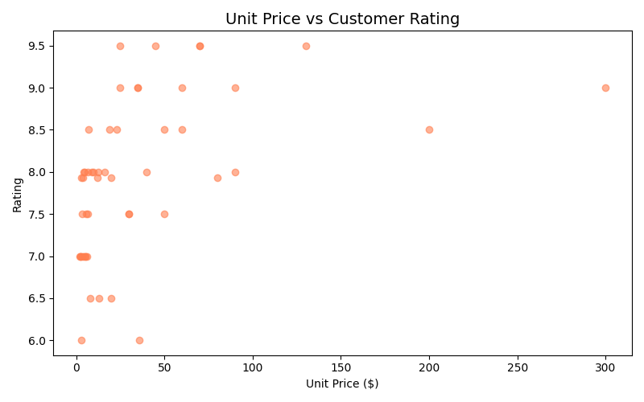
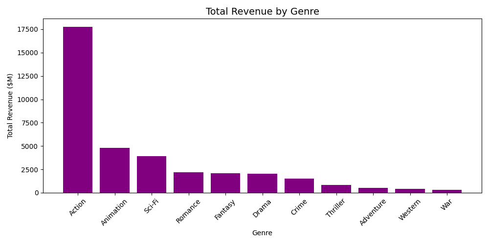
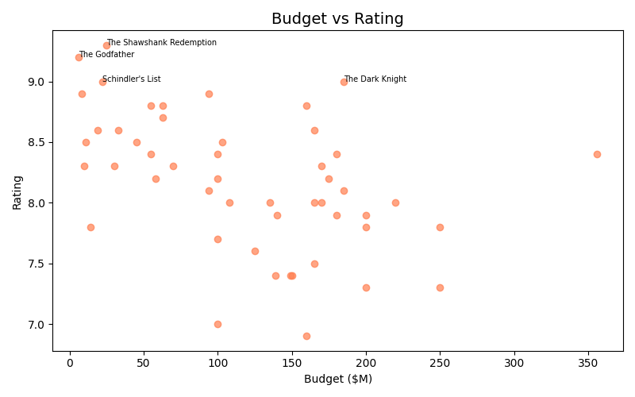
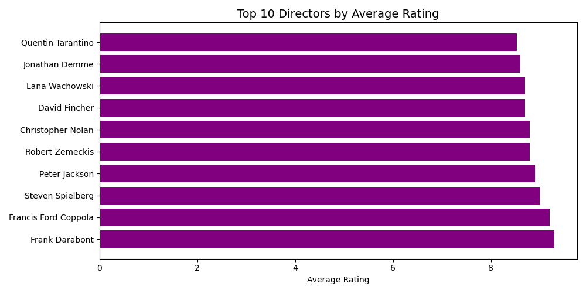
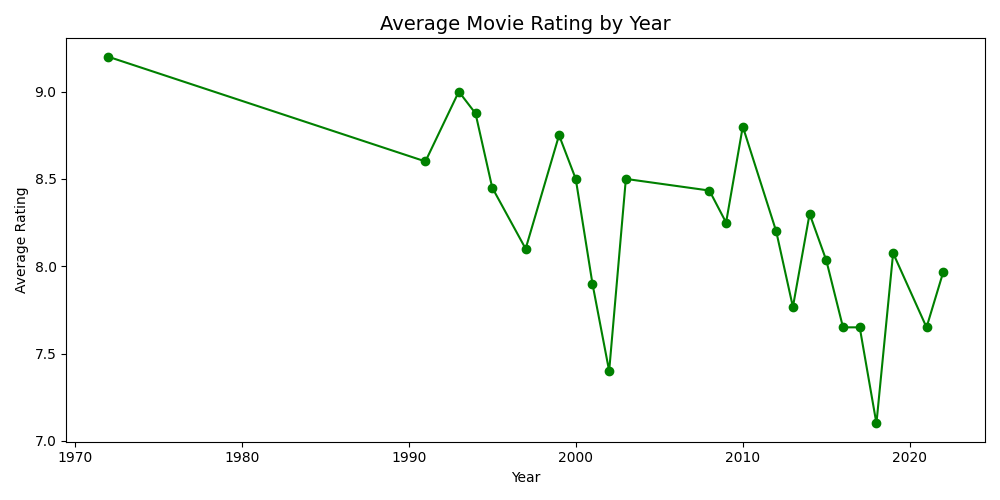

#  Data Analysis Portfolio — Week 1


**Author:** Iung Seangchanmony (Mony)  
**Program:** Year 1 Data Science & AI Engineering  
**GitHub:** github.com/flexityson

---

##  About This Repository

I'm a first-year Data Science and AI Engineering student
building real projects outside of class — because
classrooms teach theory, but GitHub teaches reality.

Every line understood before it was committed.

---

##  Projects

### 1.  Supermarket Sales — Exploratory Data Analysis
**File:** `eda_notebook.ipynb`

Explored raw supermarket sales data from scratch —
distributions, groupings, and patterns across 3 cities.

**Key questions answered:**
- Which product line generates the most revenue?
- Which city has the highest sales performance?
- What time of day do customers buy most?
- Is there a relationship between rating and total purchase?

**Charts:**





---

### 2.  Data Cleaning Project
**File:** `day4_cleaning.ipynb`

Took a deliberately broken dataset and fixed it from
scratch — missing values, duplicates, wrong data types.
The unglamorous work that makes real analysis possible.

**Skills demonstrated:**
- Handling null values (drop vs fill strategy)
- Removing duplicate rows
- Fixing incorrect data types
- Standardizing column formats
- Before/after comparison

---

### 3.  Movie Industry Analysis
**File:** `day6_movies_clean.ipynb`

The question I actually wanted to answer:
**Does spending more money make a better film?**

Short answer — **no.**
The Godfather had a $6M budget and a 9.2 rating.

**Covered:**
- 50 years of cinema data
- Revenue vs rating correlation
- Top directors by average rating
- Budget vs profitability analysis
- Best year for film quality

**Charts:**






---

##  Tech Stack

| Tool | Purpose |
|------|---------|
| Python 3 | Core language |
| Pandas | Data manipulation |
| Matplotlib | Data visualization |
| Jupyter Notebook | Analysis environment |
| Git | Version control |

---

##  How to Run

```bash
# Clone this repository
git clone https://github.com/flexityson/eda-supermarket-sales

# Install dependencies
pip install pandas matplotlib jupyter

# Launch Jupyter
jupyter notebook

# Open any .ipynb file and run all cells
```

---

##  What's Next
Week 2 → SQL and databases
Week 3 → First machine learning model
Month 2 → Cambodia economic data analysis
Month 3 → Deployed data dashboard

Building toward a complete data science
portfolio — one project at a time.

---

##  Contact

Interested in working together?

- 📧 Email: chanmony205@gmail.com

---

*"Everything else is just distraction —
keep learning and keep building."*
